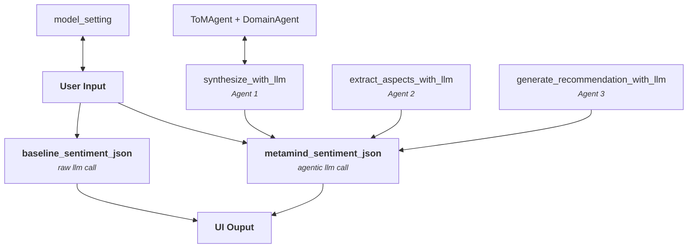

# DOCUMENTATION 

This document aims to explain the high level workflow of the project by a diagram approach then breaks down each supporting module/script by purpose.

## Simple Agentic Architecture Diagram

## Scripts and Local Dependencies 

### UI Layer
- `interface.py` (runnable)

Streamlit user interface that loads data and dependencies, triggers analysis workflow and displays the results.

### Configuration
- `config.py` (module)

Sets API credentials, model settings (e.g., temperature, max_tokens) and agents' parameters.

### LLM Layer 
- `base_llm.py` (module)
- `openai_llm.py` (module)

Initializes the language model interface used by all agents in the pipeline. 
The agents communicate with the model using the OpenAI-style API payloads and parameters.

### Agent Layer 

- `base_agent.py` (module)
- `tom_agent.py` (module)
- `domain_agent.py` (module)

ToM and Domain refinements agent from the original MetaMind framework.

### Memory Layer

- `social_memory.py` (module)

Provides user-context summaries consumed by agents during MetaMind processing.

### Prompt Library 

- `prompt_templates.py` (module)

Prompt templates injected into LLM calls across different stages of the pipeline

### Baseline Sentiment 

- `raw_sentiment.py`(module)

One-shot sentiment analysis call to the LLM that outputs a JSON. Invoked directly from the UI for comparison purpose.

### MetaMind Analysis

- `sentiment.py` (module)
- `recommandation_text.py` (module)
- `analysis/precompute_deepdive.py` (script)

Orchestrates the agentic pipeline with the 3 agents (+ToM and Domain) making hypothesis enrichment, synthesis, aspects extraction and recommandations. It also ensures the JSON format of the output and human readable recommandations from the resulted JSON.  
`analysis/precompute_deepdive.py` reuses the same baseline + MetaMind pipeline to iterate through the entire dataset and cache results into `<dataset>_deepdive.jsonl`. The Streamlit UI checks `DATASET_CONFIG["deepdive_enabled"]` and only renders the aggregate dashboards when that cache exists; otherwise the page stays in lightweight/live-analysis mode and surfaces a reminder to generate the file.

### Utilities

- `helpers.py` (helper)
- `dataset_utils.py` (helper)

`helpers.parse_json_from_string()` is a JSON parsing helper used everywhere the LLM may emit markdown/fenced outputs.  
`dataset_utils.get_dataset_paths()` normalizes the dataset CSV location and derives the deep-dive cache path (using the `data/raw` -> `data/processed` convention and suffix in `config.py`), while `load_reviews_dataframe()` handles the various CSV layouts used in the demo datasets.
