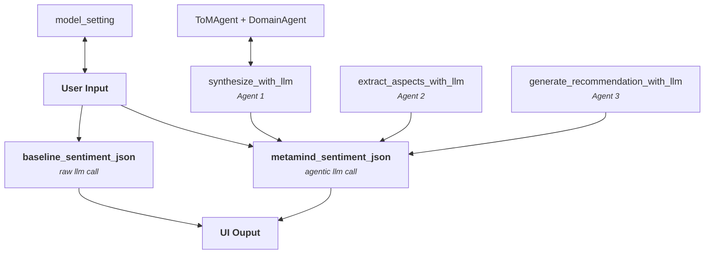

# DOCUMENTATION 

This document aims to explain the high level workflow of our project by a diagram approach then breaks down each supporting module/script purpose

## Simple Agentic Architecture Diagram

## Scripts/Local Dependencies description 

### UI Layer
- `interface_V2.py`

Streamlit user interface that load data, dependencies, triggers analysis workflow and display the results.

### Configuration
- `config.py`

Set API credentials, model settings(like temperature, max_tokens) and agents parameters

### LLM Layer 
- `__init__.py`
- `base_llm.py`
- `openai_llm.py`

Initializes the language model interface used by all agents in the pipeline. 
The agents communicate with the model using the OpenAI-style API payloads and parameters.

### Agent Layer 

- `__init__.py`
- `base_agent.py`
- `tom_agent.py`
- `domain_agent.py`

ToM and Domain refinements agent from the original MetaMind framework

### Memory Layer

- `__init__.py`
- `social_memory.py`

Provides user-context summaries consumed by agents during MetaMind processing.

### Prompt Library 

- `__init__.py`
- `prompt_templates.py`

Prompt templates injected into LLM calls across different stages of the pipeline

### Baseline Sentiment 

- `raw_sentiment.py`

One-shot sentiment analysis call to the LLM that ouput a JSON - invoked directly from the UI for comparison purpose-
### MetaMind Analysis

- `sentiment.py` 
- `recommandation_text.py`

Orchestrates the agentic pipeline with the 3 agent (+TOM and Domain) making hypothesis enrichment, synthesis, aspects extraction and recommandations. It also ensure the JSONS format of the ouput and human readable recommandations from the resulted JSON. 

### Utilites 

- `helpers.py`

A JSON parsing helper used everywhere in the pipeline 

